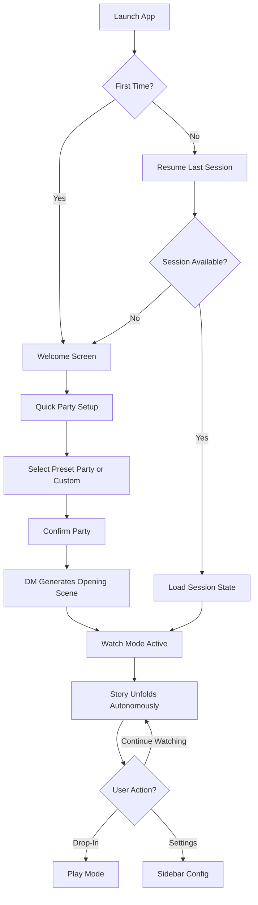
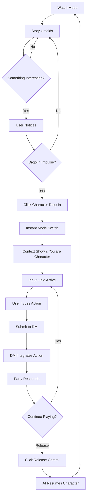
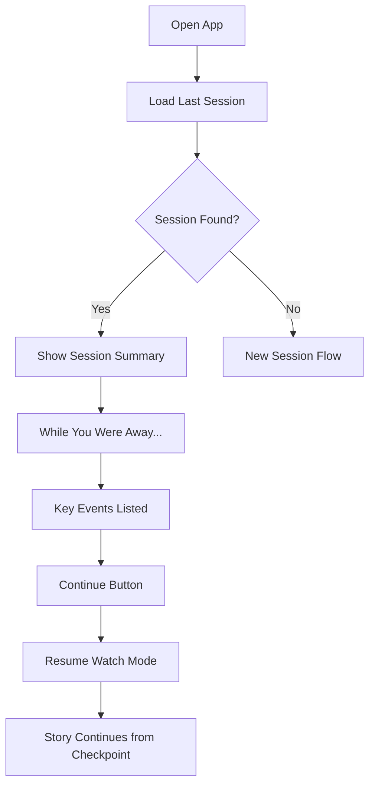
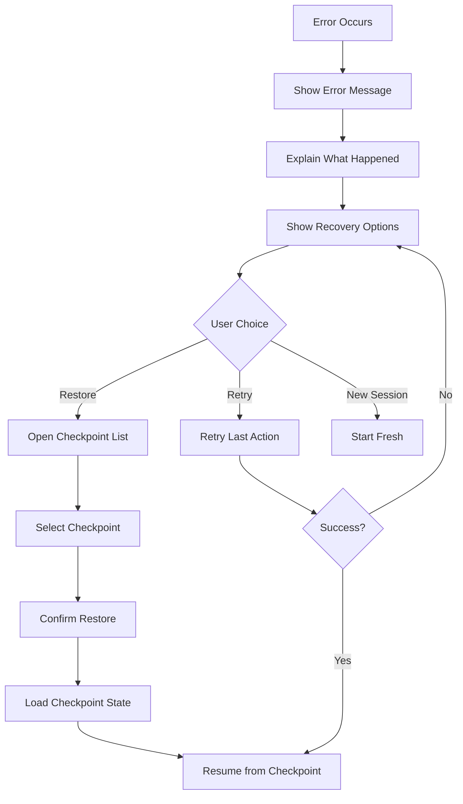
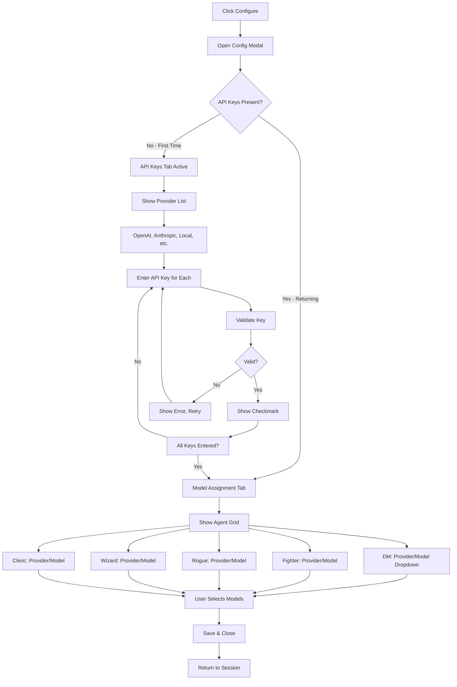
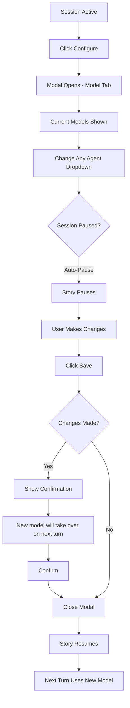
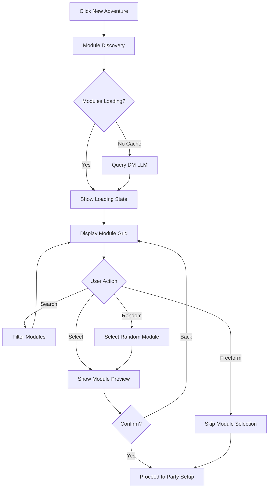
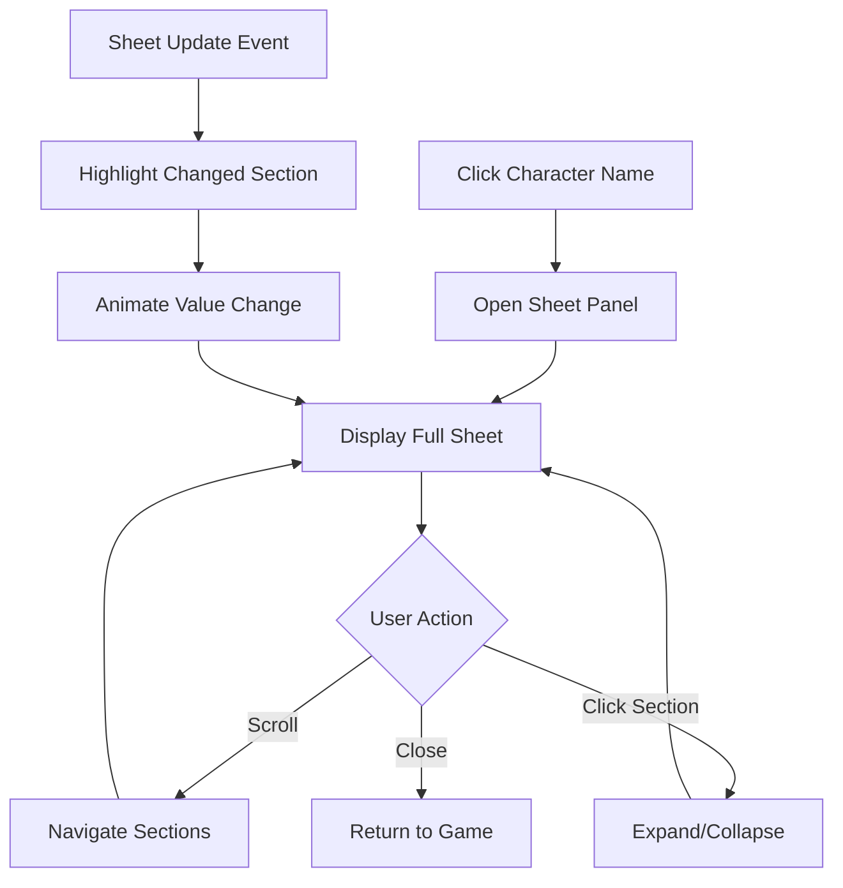
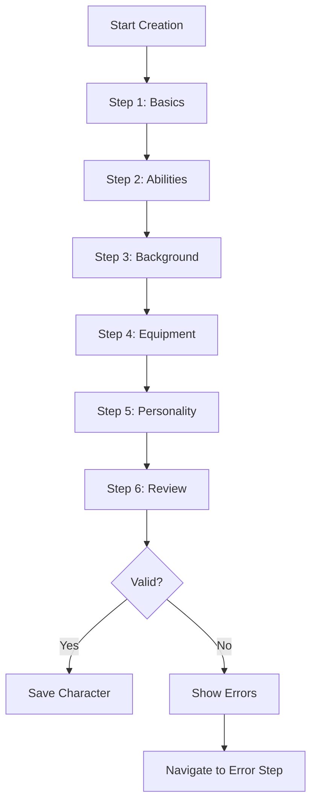

# UX Design Specification - autodungeon

**Author:** Developer
**Date:** 2026-01-24

---

## Executive Summary

### Project Vision

autodungeon brings the magic of collaborative tabletop roleplaying to anyone with a computer - no scheduling, no flaky friends, no compromise. It's a multi-agent D&D game engine where AI characters play together autonomously while humans can watch, drop in to play, or let it run unattended.

The core promise: *"Nostalgia for D&D, made accessible for people who can't coordinate 4 friends."*

This is a passion project with dual purpose - delivering genuine entertainment value to nostalgic players while advancing research into multi-agent LLM collaboration and emergent narrative behavior.

### Target Users

**Primary: Marcus - The Nostalgic Professional**

- 42-year-old professional who played D&D heavily in high school
- Every attempt to restart with friends fizzles due to scheduling conflicts
- Wants to feel like he's at the table again - on his own schedule
- Uses the product during evening wind-down time (tired, wants low friction)
- Success: "I want to watch AI characters develop relationships and jump in when I feel like it"

**Secondary: Dr. Chen - The AI Researcher**

- Uses autodungeon as a controlled environment for multi-agent behavior research
- Values full transcripts, metrics, autopilot mode
- Needs exportable data for academic analysis

**Secondary: Alex - The Content Creator**

- Sees autodungeon as a new streaming genre: "AI plays D&D"
- Values unpredictability, entertaining agent interactions, drop-in moments for dramatic effect

### Key Design Challenges

| Challenge | UX Implication |
|-----------|----------------|
| **Passive-to-Active Transition** | The shift from watching to playing must be seamless and not jar the narrative flow |
| **Information Density** | D&D generates substantial text; UI must be scannable yet immersive |
| **Character Attribution** | 5+ distinct voices require instant visual recognition |
| **Session Re-entry** | Users returning after time away need quick context restoration |
| **The "Drop-In Moment"** | Controls must feel inviting and natural, not interruptive to the story |

### Design Opportunities

| Opportunity | Potential Impact |
|-------------|------------------|
| **"Campfire" Aesthetic** | Warm, intimate UI that evokes gathering around a table - not a productivity tool |
| **Character Presence** | Distinct visual identity per character (color, icon, portrait) creates party feeling |
| **Tension Indicators** | Subtle cues when drama builds, drawing users deeper into engagement |
| **Highlight Reel** | "While you were away..." surfaces best moments from autonomous play |

---

## Core User Experience

### Defining Experience

The core experience of autodungeon is not watching, and not playing - it's the **seamless transition between them**. The magic moment is when a user shifts from passive observer to active participant without friction, hesitation, or narrative disruption.

**Core Loop:**

1. **Watch** - The story unfolds autonomously, AI characters interact
2. **Hook** - Something happens that captures attention
3. **Drop-In** - User takes control of a character instantly
4. **Play** - User contributes to the narrative naturally
5. **Drop-Out** - User releases control, AI resumes seamlessly
6. **Continue** - The story never stopped

The transition points (Watch→Drop-In and Play→Drop-Out) are where autodungeon must excel. These moments define the product's unique value.

### Platform Strategy

| Aspect | Decision |
|--------|----------|
| **Primary Platform** | Desktop web browser (Streamlit served locally) |
| **Input Method** | Mouse/keyboard primary, touch-friendly as enhancement |
| **Deployment Model** | Self-hosted - user clones repo, configures API keys, runs locally |
| **Mobile Support** | Nice-to-have for MVP, minimum 375px viewport when implemented |
| **Offline Capability** | Requires internet for cloud LLMs; Ollama enables offline play |

Desktop-first design allows focus on rich, immersive narrative experience without mobile compromises.

### Effortless Interactions

**Must Be Frictionless:**

| Interaction | Design Requirement |
|-------------|-------------------|
| **Starting a session** | One click to resume. No setup screens for returning users. |
| **Following speakers** | Instant visual recognition of who's speaking - no mental parsing |
| **Drop-In** | See something → click → playing. No confirmations, no delays. |
| **Drop-Out** | One click to release control. AI takes over mid-sentence if needed. |
| **Catching up** | Instant context for returning users - "Previously on..." |

**Automatic Behaviors:**

- Auto-save every turn (eliminate save anxiety)
- Auto-scroll to keep current action visible
- Character context loaded invisibly when dropping in
- Session state preserved across browser refreshes

### Critical Success Moments

| Moment | Success Criteria |
|--------|------------------|
| **First Launch** | User understands the concept within 30 seconds; story already in progress |
| **The Hook** | Something happens that makes user lean forward - surprise, humor, tension |
| **Drop-In Impulse** | User thinks "I have to respond" and CAN, instantly - moment not lost |
| **First Player Action** | User input lands naturally; DM and party respond; immersion maintained |
| **The Return** | One click to resume; immediate context; no lost progress |
| **The "Aha" Moment** | Agent references something from sessions ago - "They remember!" |

### Experience Principles

These principles guide all UX decisions for autodungeon:

**1. The Story Never Stops**

The narrative flows continuously. Human participation is additive, never disruptive. Entering and exiting feels like joining a conversation, not starting a new one.

**2. Instant Recognition**

Every element answers "who said this?" and "what's happening?" at a glance. No parsing required. Visual identity does the heavy lifting.

**3. Invitation, Not Interruption**

Drop-in controls are always present but never demanding. They whisper "join us" rather than shouting for attention.

**4. Memory is Magic**

Moments where agents remember and reference the past are the soul of the product. Surface these moments. Celebrate continuity.

**5. Respect the Ritual**

Users come here to wind down. The UI feels calm, warm, unhurried - a campfire gathering, not a command center.

---

## Desired Emotional Response

### Primary Emotional Goals

The core emotional experience of autodungeon is **nostalgic belonging** - that warm sense of being part of something, of stories being told around a table, of unexpected moments shared with friends... even when the "friends" are AI.

**The Emotional Journey:**

| Moment | Desired Feeling |
|--------|-----------------|
| **Opening the app** | Relief, comfort - "Ah, my evening ritual." Like settling into a favorite chair. |
| **Watching the story** | Gentle curiosity - Engaged but relaxed. Pleasantly hooked, not anxious. |
| **Something unexpected** | Delighted surprise - A laugh, a lean forward. "Wait, did they just...?" |
| **Dropping in** | Excitement + Confidence - "I know exactly what to say." No hesitation. |
| **Playing** | Creative agency - Not just reacting; actively shaping the story. |
| **Dropping out** | Satisfied release - Like putting down a good book, knowing there's more. |
| **Returning next day** | Anticipation - "I wonder what happened while I was gone..." |

### Micro-Emotions

**Emotional States to Cultivate:**

| Positive State | Description |
|----------------|-------------|
| **Confidence** | "I always know what's happening and what I can do" |
| **Trust** | "The AI gets it. They're playing their characters authentically." |
| **Anticipation** | "I can't wait to see what happens next" |
| **Companionship** | "I'm part of this party, even when just watching" |
| **Discovery** | "Every session brings something new and surprising" |

**Emotional States to Prevent:**

| Danger State | Prevention Strategy |
|--------------|---------------------|
| **FOMO** | Clear catch-up mechanism, highlight reel for missed content |
| **Performance Anxiety** | Low stakes messaging, AI adapts to any input, easy recovery |
| **Overwhelm** | Clean visual hierarchy, character colors, scannable format |
| **Boredom** | DM pacing awareness, tension curves, varied encounter types |
| **Uncanny Valley** | Keep it playful, characters have quirks and flaws, embrace the game |

**The Critical Emotion: Companionship**

The sense of companionship is the secret ingredient. Users aren't watching an AI demo - they're hanging out with their party. The rogue's sarcasm, the paladin's righteousness, the wizard's overthinking... these become *their* characters over time.

### Design Implications

**Emotion-to-Design Mapping:**

| Desired Emotion | UX Design Approach |
|-----------------|-------------------|
| **Nostalgic belonging** | Warm color palette, "campfire" aesthetic, character portraits that feel like friends |
| **Relief on entry** | One-click resume, no setup screens, story already in motion |
| **Gentle curiosity** | Smooth auto-scroll, readable pace, no jarring interruptions |
| **Delighted surprise** | Highlight unexpected moments, subtle tension indicators |
| **Confidence when dropping in** | Always-visible controls, instant feedback, character context at a glance |
| **Creative agency** | Free-form text input, DM acknowledges choices, party reacts meaningfully |
| **Companionship** | Character personality consistency, distinct voices, callbacks to shared history |
| **Anticipation on return** | "While you were away..." summary, story hooks left dangling |

### Emotional Design Principles

**1. Warmth Over Efficiency**

This isn't a productivity tool. Every design choice should feel like gathering around a fire, not operating a machine. Rounded corners, warm tones, gentle animations.

**2. Characters Are People**

The AI agents aren't "outputs" - they're party members. Give them visual presence, consistent voices, memorable quirks. When the rogue speaks, you should *hear* him.

**3. Low Stakes, High Stories**

Remove performance anxiety. There's no wrong move. The story adapts. Mistakes become plot points. The only failure is not having fun.

**4. Presence Without Pressure**

Drop-in controls are always there, always inviting, never demanding. Like an empty chair at the table - it's yours whenever you want it.

**5. Memory Creates Meaning**

Every callback to past events deepens emotional investment. Surface these moments. Make "they remember!" the recurring delight.

---

## UX Pattern Analysis & Inspiration

### Inspiring Products Analysis

autodungeon draws inspiration from leading AI conversation interfaces, each offering lessons for our unique multi-agent narrative experience:

**Character.AI**

- Character persistence creates emotional connection - you're talking to "them," not "it"
- Avatar presence and visual identity make characters feel like people
- Personality bleeds through consistently in every response
- Character name as clear header provides instant attribution

**SillyTavern**

- Roleplay-focused formatting: *italics for actions/narration*, regular text for dialogue
- Group chat mode with multiple AI characters - directly applicable to party dynamics
- Character cards and portraits create visual presence
- Dark mode by default supports evening wind-down use case
- Power-user customization available but not required

**ChatGPT**

- Clean, scannable interface with clear turn separation
- Minimal chrome keeps focus on the conversation
- Message bubbles with clear separation between speakers
- Controls appear on hover, not cluttering by default
- Input area is prominent and inviting

**Gemini Chat**

- Fluid streaming creates engagement and anticipation
- Clean typography with generous spacing
- Modern, uncluttered aesthetic
- Whitespace used effectively for readability

### Transferable UX Patterns

**Patterns to Adopt Directly:**

| Pattern | Source | Application |
|---------|--------|-------------|
| Character name as clear header | Character.AI | Every message instantly attributed to speaker |
| *Italics* for actions, regular for dialogue | SillyTavern | D&D convention, separates narration from speech |
| Clean typography, generous spacing | Gemini | Readability during extended sessions |
| Message bubbles with clear separation | ChatGPT | Visual chunking for multi-speaker flow |
| Personality consistency | Character.AI | Each PC has distinct, recognizable voice |

**Patterns to Adapt:**

| Pattern | Source | Adaptation for autodungeon |
|---------|--------|---------------------------|
| Group chat mode | SillyTavern | DM as special "narrator" voice, visually distinct from PCs |
| Prominent input area | ChatGPT | Present in drop-in mode; hidden/minimal in watch mode |
| Character cards | SillyTavern | Simplified to color + portrait + name (not full stat blocks) |
| Streaming responses | Gemini | Turn-by-turn reveal, not word-by-word (maintains narrative pacing) |

**Patterns Unique to autodungeon:**

| Pattern | Purpose |
|---------|---------|
| Drop-In affordance per character | One-click to take control of any PC |
| Passive/active mode toggle | Seamless transition between watching and playing |
| "While you were away" summary | Catch-up mechanism for returning users |
| Tension/drama indicators | Subtle visual cues when story intensity increases |

### Anti-Patterns to Avoid

| Anti-Pattern | Why It's Wrong for autodungeon |
|--------------|-------------------------------|
| **Wall of undifferentiated text** | With 5+ speakers, instant attribution is essential |
| **Tiny avatars or no visual identity** | Characters need PRESENCE for emotional connection |
| **Modal interruptions** | "Are you sure?" dialogs kill narrative flow |
| **Complex settings upfront** | Config belongs in sidebar, not blocking the story |
| **Regenerate-heavy UI** | In group improv, you roll with what happens |
| **Cold, clinical aesthetic** | Blue/white "AI assistant" vibes kill campfire warmth |
| **Disappearing input field** | Drop-in control must always be accessible |
| **No DM/PC distinction** | Narrator and characters need different visual treatment |

### Design Inspiration Strategy

**Core Philosophy:** Learn from the best AI chat interfaces while creating something new for multi-agent narrative.

**Adopt:**

- Clear speaker attribution (name + visual identity)
- Action/dialogue formatting convention (*italics*/regular)
- Clean, spacious typography
- Bubble-based message separation

**Adapt:**

- Group chat → with DM as distinct narrator voice
- Input prominence → context-dependent (watch vs. play mode)
- Character presence → simplified but warm (portraits, colors)

**Invent:**

- Drop-in/drop-out mechanics (no existing pattern)
- Passive observation mode with active participation option
- Session continuity and catch-up systems
- Narrative tension indicators

**Avoid:**

- Clinical AI assistant aesthetics
- Interrupting modals and confirmations
- Visual clutter and tiny avatars
- Undifferentiated multi-speaker text

---

## Design System Foundation

### Design System Choice

**Selected Approach:** Streamlit Native + Heavy Custom CSS Theming

Streamlit provides the application framework while custom CSS transforms the visual experience from "data dashboard" to "campfire storytelling." This approach balances development speed with the unique aesthetic autodungeon requires.

### Rationale for Selection

| Factor | Decision Driver |
|--------|-----------------|
| **Solo Developer** | Streamlit handles complex state/reactivity; focus custom work where it matters |
| **Passion Project** | Don't over-engineer; ship fast, iterate based on feel |
| **Unique Aesthetic Need** | Stock Streamlit looks like a dashboard; heavy CSS theming transforms it |
| **Narrative-First Product** | The story display is THE product; that's where customization investment goes |
| **Evening Use Case** | Dark mode essential; warm tones required; Streamlit supports custom theming |

### Implementation Approach

**Framework Architecture:**

| Layer | Technology | Purpose |
|-------|------------|---------|
| **Application Shell** | Streamlit Native | Layout, state management, reactivity, sidebar |
| **Visual Theme** | config.toml + CSS | Colors, typography, spacing, dark mode |
| **Narrative Display** | Custom CSS via st.markdown | Message bubbles, character styling, animations |
| **Special Components** | st.components (if needed) | Any truly custom interactive elements |

**Development Strategy:**

1. Start with Streamlit's native components for all functionality
2. Apply custom theme via config.toml for base colors and fonts
3. Inject custom CSS for narrative area styling
4. Define character colors as CSS variables for consistency
5. Iterate on visual polish after core functionality works

### Customization Strategy

**Heavy Customization (Soul of the Experience):**

| Element | Customization |
|---------|---------------|
| **Narrative Display** | Dark background, warm tones, generous spacing, message bubbles with character colors |
| **Character Identity** | Color-coded borders/accents, portrait display area, distinct DM narrator styling |
| **Typography** | Readable fonts optimized for extended narrative reading; clear hierarchy |
| **Color Palette** | Campfire warmth: deep browns, amber, soft orange accents, parchment highlights |
| **Drop-In Controls** | Inviting button styling, subtle hover/glow states, always accessible |
| **Mode Indicators** | Clear visual distinction between Watch Mode and Play Mode |

**Keep Native (Don't Fight Streamlit):**

| Element | Rationale |
|---------|-----------|
| **Sidebar** | Streamlit's sidebar is well-designed for configuration/settings |
| **Form Inputs** | Native inputs with color theming; no need to rebuild |
| **Layout System** | Streamlit's columns and containers work well |
| **Session State** | Streamlit's state management is robust and well-tested |
| **Basic Navigation** | Use Streamlit patterns for page/view management |

**Theme Direction:**

| Aspect | Specification |
|--------|---------------|
| **Mode** | Dark mode first (evening wind-down use case) |
| **Temperature** | Warm dark (browns, ambers) not cold dark (blues, grays) |
| **Contrast** | High contrast for extended reading comfort |
| **Typography Scale** | Generous sizing for narrative text; smaller for UI chrome |
| **Spacing** | Generous whitespace in narrative; compact in controls |

**CSS Variable Strategy:**

```css
/* Character Identity Colors */
--color-dm: #D4A574;      /* Warm gold for narrator */
--color-fighter: #C45C4A;  /* Bold red */
--color-rogue: #6B8E6B;    /* Forest green */
--color-wizard: #7B68B8;   /* Mystic purple */
--color-cleric: #4A90A4;   /* Calm blue */

/* Theme Colors */
--bg-primary: #1A1612;     /* Deep warm black */
--bg-secondary: #2D2520;   /* Warm gray-brown */
--bg-message: #3D3530;     /* Message bubble background */
--text-primary: #F5E6D3;   /* Warm off-white */
--text-secondary: #B8A896; /* Muted warm gray */
--accent-warm: #E8A849;    /* Amber highlight */
```

---

## Defining Experience

### The Core Interaction

**autodungeon's defining experience:**

> **"Watch AI characters play D&D together, and drop in whenever you want"**

Or simply: **"D&D that plays itself - until you want to join"**

This captures the unique value: it's not "play D&D with AI" (that's AI Dungeon). It's *watch* AI play, with the freedom to participate. The watching is the product. The dropping in is the delight.

### Interaction Flow

| Phase | What Happens | User Mental State |
|-------|--------------|-------------------|
| **Default State** | Story unfolds autonomously | Relaxed, entertained, curious |
| **The Hook** | Something compelling happens | Leaning forward, engaged |
| **The Impulse** | "I need to respond to that" | Excited, confident |
| **The Drop-In** | One click → user is playing | Immersed, creative |
| **The Play** | User contributes naturally | Agentic, part of the story |
| **The Release** | One click → AI resumes | Satisfied, still watching |

### User Mental Model

Users bring existing mental models from related experiences:

| Reference | What They Expect | How autodungeon Differs |
|-----------|-----------------|------------------------|
| **Watching Critical Role** | Passive entertainment, can't affect outcome | Can jump in and affect the story |
| **Playing Baldur's Gate 3** | Active all the time, their story | Story happens without them; join when interested |
| **ChatGPT conversations** | User drives, AI responds | AI drives, user joins the ride |
| **Twitch streams** | Watch + chat on the side | Watch + *become* a character |

**Key Mental Model Shift:** The story is *always running* - users aren't starting it, they're joining it. Like walking into a room where friends are already playing, pulling up a chair, and saying "I'll take over for a bit."

### Preventing Confusion

| Potential Confusion | Prevention Strategy |
|---------------------|---------------------|
| "Do I need to do something?" | Clear "Watch Mode" indicator; story progresses without input |
| "How do I join?" | Obvious, always-visible Drop-In buttons per character |
| "What if I mess up the story?" | Low stakes messaging; AI adapts; "there are no wrong moves" |
| "What happened while I was gone?" | "While you were away..." catch-up summary |

### Success Criteria

**The core interaction succeeds when:**

1. User understands Watch Mode is the default within 30 seconds
2. Drop-In buttons are noticed but don't demand attention
3. Transition from watching to playing takes < 2 seconds
4. User's first input feels natural and acknowledged
5. Releasing control back to AI is equally frictionless
6. User returns the next day wanting to see what happened

### Experience Mechanics

**1. Initiation (Watch Mode):**
- App opens to active story (or "Continue" if returning)
- Narrative auto-scrolls at readable pace
- Characters speak, act, interact autonomously
- Drop-In buttons visible but subtle for each PC

**2. The Hook (Engagement):**
- Something interesting happens in the narrative
- Possible tension indicator (subtle glow/pulse)
- User's attention captured by character interaction

**3. Drop-In (Transition):**
- User clicks character's Drop-In button
- Input field appears/expands immediately
- Brief context shown: "You are [Character]. [Current situation]."
- No confirmation dialogs - instant transition

**4. Play Mode (Active):**
- User types their action/dialogue
- Submit sends to DM for integration
- DM acknowledges and weaves into narrative
- Other PCs (AI) respond naturally
- User can continue or release

**5. Release (Return to Watch):**
- User clicks "Release Control" or simply stops
- AI seamlessly takes over character
- Story continues without jarring transition
- User returns to passive observation

### Novel UX Patterns

**What's Novel (We Must Invent):**

| Pattern | Why It's New |
|---------|--------------|
| **Drop-In/Drop-Out** | No existing AI product has seamless human↔AI character control |
| **Passive-First AI Interaction** | Most AI apps require user to initiate; we flip this |
| **Multi-Agent Observation** | Watching AIs interact (not just responding to user) |
| **Narrative Tension Indicators** | Subtle cues that "something interesting is happening" |

**What's Established (We Adopt):**

| Pattern | Source |
|---------|--------|
| Chat bubble interface | ChatGPT, messaging apps |
| Character attribution | Character.AI, SillyTavern |
| Action/dialogue formatting | Roleplay conventions |
| Session persistence | Any saved game |

---

## Visual Design Foundation

### Color System

**Established Palette (from Design System Foundation):**

The color system creates campfire warmth - deep browns, amber highlights, and character-specific accents that feel like gathering around a table with friends.

| Category | Variable | Value | Purpose |
|----------|----------|-------|---------|
| **Background** | --bg-primary | #1A1612 | Main canvas - deep warm black |
| **Background** | --bg-secondary | #2D2520 | Elevated surfaces - warm gray-brown |
| **Background** | --bg-message | #3D3530 | Message bubbles |
| **Text** | --text-primary | #F5E6D3 | Primary content - warm off-white |
| **Text** | --text-secondary | #B8A896 | Secondary content - muted warm gray |
| **Accent** | --accent-warm | #E8A849 | Highlights, focus states - amber |

**Character Identity Colors:**

| Character | Variable | Value | Personality |
|-----------|----------|-------|-------------|
| DM/Narrator | --color-dm | #D4A574 | Warm gold - authoritative but warm |
| Fighter | --color-fighter | #C45C4A | Bold red - action, courage |
| Rogue | --color-rogue | #6B8E6B | Forest green - cunning, shadow |
| Wizard | --color-wizard | #7B68B8 | Mystic purple - arcane, intellect |
| Cleric | --color-cleric | #4A90A4 | Calm blue - faith, healing |

**Semantic Colors:**

| Purpose | Value | Use |
|---------|-------|-----|
| Success | #6B8E6B | Positive outcomes, completed actions |
| Warning | #E8A849 | Attention needed, tension moments |
| Error | #C45C4A | Failed rolls, critical situations |
| Info | #4A90A4 | System messages, tips |

### Typography System

**Font Stack:**

| Role | Font | Fallback | Weight Range |
|------|------|----------|--------------|
| **Narrative** | Lora | Georgia, serif | 400, 600 |
| **UI** | Inter | system-ui, sans-serif | 400, 500, 600 |
| **Monospace** | JetBrains Mono | monospace | 400 |

**Type Scale:**

| Element | Size | Line Height | Weight | Font |
|---------|------|-------------|--------|------|
| DM Narration | 18px | 1.6 | 400 | Lora |
| PC Dialogue | 17px | 1.6 | 400 | Lora |
| Character Name | 14px | 1.4 | 600 | Inter |
| UI Controls | 14px | 1.4 | 500 | Inter |
| System Text | 13px | 1.4 | 400 | Inter |
| Dice/Stats | 14px | 1.4 | 400 | JetBrains Mono |

**Typography Principles:**

1. Serif for story, sans for system - clear separation of narrative vs. UI
2. Generous line height (1.6) for extended reading comfort
3. Size hierarchy reinforces speaker importance (DM > PC > System)
4. Weight used sparingly - bold for names and emphasis only

### Spacing & Layout Foundation

**Spacing Scale (8px base):**

| Token | Value | Use |
|-------|-------|-----|
| --space-xs | 4px | Tight internal spacing |
| --space-sm | 8px | Related element spacing |
| --space-md | 16px | Standard component spacing |
| --space-lg | 24px | Section separation |
| --space-xl | 32px | Major section breaks |
| --space-2xl | 48px | Page-level spacing |

**Layout Specifications:**

| Element | Specification |
|---------|---------------|
| Max content width | 800px |
| Sidebar width | 240px |
| Message padding | 16px horizontal, 12px vertical |
| Message gap | 16px between messages |
| Character line length | ~70 characters optimal |

**Layout Zones:**

| Zone | Purpose | Behavior |
|------|---------|----------|
| **Header** | Session info, mode indicator | Fixed, minimal height |
| **Party Panel** | Character list, drop-in controls | Fixed sidebar, scrollable |
| **Narrative Area** | Story messages | Scrollable, auto-scroll in Watch Mode |
| **Input Area** | User input when dropped in | Expandable, hidden in Watch Mode |

### Accessibility Considerations

**Contrast Compliance:**

| Combination | Ratio | Level |
|-------------|-------|-------|
| --text-primary on --bg-primary | 11.5:1 | AAA |
| --text-secondary on --bg-primary | 5.8:1 | AA |
| --text-primary on --bg-message | 8.2:1 | AAA |
| Character colors on --bg-message | 4.5:1+ | AA |

**Reading Comfort:**

- No pure white or pure black - all colors have warm undertones
- Minimum 17px for narrative text
- 1.6 line height for comfortable reading
- Maximum 75 characters per line

**Interaction Standards:**

- All interactive elements have visible focus states (--accent-warm glow)
- Keyboard navigation for all controls
- No time-dependent interactions required
- Auto-scroll pausable via user scroll or toggle

**Evening Use Optimization:**

- Warm color temperature reduces eye strain
- High contrast without harsh brightness
- Dark mode only - no light mode option needed

---

## Design Direction Decision

### Design Directions Explored

Six distinct visual directions were created and evaluated:

1. **Classic Sidebar** - Traditional layout with party panel left, narrative center, clear separation
2. **Minimal Theater** - Story dominates, controls appear on hover, maximum immersion
3. **Immersive Scroll** - Full-width narrative, party as header chips, cinematic feel
4. **Cozy Tavern** - Rounded cards, warm shadows, intimate groupings
5. **Parchment & Ink** - Manuscript aesthetic, literary typography, chronicle feel
6. **Modern Minimal** - Clean lines, subtle colors, contemporary appearance

### Chosen Direction

**Hybrid: Classic Sidebar + Manuscript Narrative**

Combines the functional clarity of Direction 1's sidebar with the literary, nostalgic feel of Direction 5's manuscript-style narrative area.

| Component | Source | Specification |
|-----------|--------|---------------|
| **Layout** | Direction 1 | Fixed 240px sidebar + scrollable manuscript main area |
| **Party Panel** | Direction 1 | Character cards with avatar, name, class, Drop-In button |
| **Narrative Style** | Direction 5 | Justified text, literary typography, chronicle feel |
| **Character Attribution** | Direction 5 | "Character Name, the Class:" format with character color |
| **DM Styling** | Direction 5 | Special block with gold accent border, italic narration |
| **Session Header** | Direction 5 | Chronicle-style title ("Session VII") |

### Design Rationale

**Why This Combination Works:**

1. **Functional Accessibility** - Drop-In controls always visible in sidebar, never hunting for the core interaction
2. **Narrative Immersion** - Manuscript styling makes users feel they're reading a chronicle, not chatting with a bot
3. **Clear Separation** - Functional UI (sidebar) stays distinct from immersive content (narrative)
4. **D&D Nostalgia** - Literary attribution echoes adventure module prose style
5. **Evening Wind-Down** - Justified text and warm tones create calm, unhurried reading experience

**Key Design Decisions:**

| Decision | Choice | Reasoning |
|----------|--------|-----------|
| Sidebar position | Fixed left | Familiar pattern, always accessible |
| Character attribution | "Name, the Class:" | Literary, nostalgic, clear speaker identification |
| Text alignment | Justified in narrative | Manuscript/book feel, professional appearance |
| DM treatment | Block with gold accent | Narrator stands apart from character dialogue |
| Drop-In visibility | Always visible | Core interaction must be instant |

### Implementation Approach

**Phase 1: Layout Structure**

- Implement sidebar + main area grid layout (240px + 1fr)
- Create party panel component with character cards
- Build narrative container with manuscript styling
- Add session header with chronicle formatting

**Phase 2: Message Components**

- DM narration block with gold accent border and italic text
- PC dialogue with "Name, the Class:" attribution in character color
- Action/narration in italics, dialogue in regular text
- Justified text alignment for literary feel

**Phase 3: Interactive Elements**

- Drop-In buttons with character color theming
- Mode indicator (Watch/Play) in sidebar header
- Input area expansion on Drop-In
- Release control button for returning to Watch Mode

**Phase 4: Polish**

- Typography fine-tuning (Lora for narrative, Inter for UI)
- Spacing refinement using 8px grid
- Subtle texture overlay on main narrative area
- Focus states and keyboard navigation

### Reference Implementation

An interactive HTML prototype demonstrating the chosen design direction is available at:

`planning-artifacts/ux-design-directions.html`

This prototype includes:

- Working Watch Mode and Play Mode toggle
- Functional Drop-In buttons for each character
- Complete narrative example with DM and PC messages
- Input area with context display
- All established colors, typography, and spacing applied

---

## User Journey Flows

### Source Journeys (from PRD)

| Journey | User | Core Scenario |
|---------|------|---------------|
| **Marcus Happy Path** | Nostalgic professional | Discover → Setup → Watch → Drop-In → Ongoing engagement |
| **Marcus Recovery** | Same user, mid-campaign | Error occurs → Restore from checkpoint → Continue |
| **Dr. Chen Research** | AI researcher | Configure → Autopilot → Export transcripts → Analyze |
| **Alex Content** | Twitch streamer | Setup → Stream → Drop-in during broadcast → Viral moment |

### Critical Flows Identified

Based on PRD journeys and the core experience ("watch AI play D&D, drop in when you want"), four critical flows require detailed design:

1. **First Session Flow** - New user's first 5 minutes (onboarding to active watching)
2. **Watch → Drop-In → Release Flow** - The core interaction loop (defining experience)
3. **Session Continuity Flow** - Returning user experience (resume previous session)
4. **Session Recovery Flow** - Error handling and checkpoint restore

### Flow 1: First Session

**Entry Point:** User has cloned repo, configured API keys, runs `streamlit run app.py`



**Key Decisions:**
- First-time users see brief party setup (not demo mode - get them playing fast)
- Preset parties available for instant start
- Returning users go straight to their session

### Flow 2: Watch → Drop-In → Release (Core Experience)

**Entry Point:** User is in Watch Mode, story is flowing



**Critical Timing:**
- Drop-In transition: < 2 seconds
- No confirmation dialogs
- Context appears immediately
- Release is equally instant

### Flow 3: Session Continuity (Returning User)

**Entry Point:** User opens app after previous session



**Key Elements:**
- "While you were away..." summary for context
- One-click resume
- Session state fully restored

### Flow 4: Session Recovery (Error Handling)

**Entry Point:** Error occurs during session (API failure, etc.)



**Key Elements:**
- Clear error messaging (not technical jargon)
- Checkpoint list with timestamps and context
- One-click restore
- Minimal data loss (auto-checkpoint every turn)

### Journey Patterns

**Navigation Patterns:**
- Sidebar always visible for party access and settings
- Main area dedicated to narrative flow
- Mode indicator shows current state (Watch/Play)

**Transition Patterns:**
- All mode transitions are instant (< 2 seconds)
- No confirmation dialogs for reversible actions
- Context provided inline, not in modals

**Feedback Patterns:**
- Pulsing dot indicates active story progression
- Character highlight when user is controlling
- Subtle animations for state changes

**Error Patterns:**
- Friendly language, not technical errors
- Always offer recovery path
- Preserve user progress via checkpoints

### Flow Optimization Principles

1. **Minimize Time to Value** - New users watching a story within 60 seconds
2. **Zero-Friction Core Loop** - Drop-in/release with single clicks, no confirmations
3. **Progressive Disclosure** - Settings in sidebar, not blocking the story
4. **Graceful Degradation** - Errors never lose more than one turn of progress
5. **Context Always Available** - Never leave user wondering "what's happening?"

### Flow 5: Configuration Setup

**Entry Point:** User clicks "Configure" button in sidebar header



**Key Elements:**

- **Dual API Key Approach:** `.env` file detection for power users + UI entry for convenience
- **Per-Agent Model Selection:** DM always separate from PCs, each PC independently configurable
- **Tab Structure:** API Keys | Model Assignment | Game Settings
- **Validation Before Save:** Keys tested, models confirmed available

### Flow 6: Mid-Session Model Change

**Entry Point:** User wants to swap an agent's model during active session



**Key Behaviors:**

- Opening config modal auto-pauses story generation
- Changes take effect on next turn (not mid-message)
- Clear confirmation of what will change
- Closing modal resumes story

### Configuration UI Patterns

**Modal Structure:**

| Tab | Contents |
|-----|----------|
| **API Keys** | Provider list with key entry fields, validation status |
| **Models** | Agent grid with provider/model dropdowns per agent |
| **Settings** | Auto-save frequency, transcript export, speed controls |

**Agent Grid Layout:**

| Agent | Provider | Model | Status |
|-------|----------|-------|--------|
| **DM** | [Dropdown] | [Dropdown] | Active |
| **Fighter** | [Dropdown] | [Dropdown] | AI / You |
| **Rogue** | [Dropdown] | [Dropdown] | AI |
| **Wizard** | [Dropdown] | [Dropdown] | AI |
| **Cleric** | [Dropdown] | [Dropdown] | AI |

**Quick Actions:**

- "Copy DM settings to all PCs" - One click uniformity
- "Reset to defaults" - Return to recommended config
- "Test connection" - Validate API access

---

## Component Strategy

### Design System Components (Streamlit Native)

| Component | Streamlit Element | Customization Level |
|-----------|-------------------|---------------------|
| Text display | `st.markdown` | Heavy CSS (manuscript styling) |
| Text input | `st.text_area` | Moderate CSS (theme colors) |
| Buttons | `st.button` | Heavy CSS (character theming) |
| Sidebar | `st.sidebar` | Moderate CSS (width, colors) |
| Modal | `st.dialog` | Heavy CSS (dark theme) |
| Dropdowns | `st.selectbox` | Moderate CSS (theme colors) |
| Tabs | `st.tabs` | Heavy CSS (tab styling) |

### Custom Components

#### 1. Character Card (Sidebar)

**Streamlit Base:** `st.container` with custom CSS class

**Purpose:** Display party member with Drop-In control

```
┌─────────────────────────┐
│ [Avatar] Name           │
│          Class          │
│ [Drop-In Button]        │
└─────────────────────────┘
```

**CSS Specification:**

```css
.character-card {
    background: var(--bg-secondary);      /* #2D2520 */
    border-radius: 8px;
    padding: var(--space-md);             /* 16px */
    margin-bottom: var(--space-sm);       /* 8px */
    border-left: 3px solid var(--character-color);
}

.character-card.controlled {
    background: var(--bg-message);        /* #3D3530 */
    border-left-width: 4px;
    box-shadow: 0 0 12px rgba(232, 168, 73, 0.2);
}

.character-name {
    font-family: Inter, system-ui, sans-serif;
    font-size: 14px;
    font-weight: 600;
    color: var(--character-color);
}

.character-class {
    font-family: Inter, system-ui, sans-serif;
    font-size: 13px;
    color: var(--text-secondary);         /* #B8A896 */
}

.drop-in-button {
    background: transparent;
    border: 1px solid var(--character-color);
    color: var(--character-color);
    border-radius: 4px;
    padding: 6px 12px;
    font-family: Inter;
    font-size: 13px;
    cursor: pointer;
    transition: all 0.15s ease;
}

.drop-in-button:hover {
    background: var(--character-color);
    color: var(--bg-primary);
}

.drop-in-button.active {
    background: var(--character-color);
    color: var(--bg-primary);
}
```

**States:**

- Default: Outline button, card at rest
- Hover: Button fills with character color
- Controlled: Card highlighted, button shows "Release"

#### 2. Narrative Message (DM)

**Streamlit Base:** `st.markdown` with custom container

**Purpose:** Display DM narration in manuscript style

```
┌────────────────────────────────────────┐
│ ║  The tavern falls silent as the      │
│ ║  stranger enters, her cloak          │
│ ║  dripping with rain...               │
└────────────────────────────────────────┘
```

**CSS Specification:**

```css
.dm-message {
    background: var(--bg-message);        /* #3D3530 */
    border-left: 4px solid var(--color-dm); /* #D4A574 */
    padding: var(--space-md) var(--space-lg); /* 16px 24px */
    margin-bottom: var(--space-md);       /* 16px */
    border-radius: 0 8px 8px 0;
}

.dm-message p {
    font-family: Lora, Georgia, serif;
    font-size: 18px;
    line-height: 1.6;
    color: var(--text-primary);           /* #F5E6D3 */
    font-style: italic;
    text-align: justify;
    margin: 0;
}
```

#### 3. Narrative Message (PC)

**Streamlit Base:** `st.markdown` with custom container

**Purpose:** Display PC dialogue and actions

```
┌────────────────────────────────────────┐
│ Theron, the Fighter:                   │
│ "We should proceed with caution."      │
│ *He places a hand on his sword hilt.*  │
└────────────────────────────────────────┘
```

**CSS Specification:**

```css
.pc-message {
    background: var(--bg-message);        /* #3D3530 */
    padding: var(--space-md);             /* 16px */
    margin-bottom: var(--space-md);       /* 16px */
    border-radius: 8px;
}

.pc-attribution {
    font-family: Lora, Georgia, serif;
    font-size: 14px;
    font-weight: 600;
    color: var(--character-color);
    margin-bottom: var(--space-xs);       /* 4px */
}

.pc-message p {
    font-family: Lora, Georgia, serif;
    font-size: 17px;
    line-height: 1.6;
    color: var(--text-primary);           /* #F5E6D3 */
    text-align: justify;
    margin: 0;
}

.pc-message .action-text {
    font-style: italic;
    color: var(--text-secondary);         /* #B8A896 */
}
```

#### 4. Mode Indicator

**Streamlit Base:** `st.markdown` badge

**Purpose:** Show Watch/Play mode state

**CSS Specification:**

```css
.mode-indicator {
    display: inline-flex;
    align-items: center;
    gap: var(--space-xs);                 /* 4px */
    padding: 4px 12px;
    border-radius: 16px;
    font-family: Inter, system-ui, sans-serif;
    font-size: 12px;
    font-weight: 500;
}

.mode-indicator.watch {
    background: rgba(107, 142, 107, 0.2); /* Success green, transparent */
    color: #6B8E6B;
}

.mode-indicator.play {
    background: rgba(232, 168, 73, 0.2);  /* Accent amber, transparent */
    color: var(--accent-warm);            /* #E8A849 */
}

.mode-indicator .pulse-dot {
    width: 8px;
    height: 8px;
    border-radius: 50%;
    background: currentColor;
    animation: pulse 2s ease-in-out infinite;
}

@keyframes pulse {
    0%, 100% { opacity: 1; transform: scale(1); }
    50% { opacity: 0.5; transform: scale(0.8); }
}
```

#### 5. Session Header

**Streamlit Base:** `st.markdown` in main area

**Purpose:** Chronicle-style session title

**CSS Specification:**

```css
.session-header {
    text-align: center;
    padding: var(--space-lg) 0;           /* 24px */
    border-bottom: 1px solid var(--bg-secondary);
    margin-bottom: var(--space-lg);
}

.session-title {
    font-family: Lora, Georgia, serif;
    font-size: 24px;
    font-weight: 600;
    color: var(--color-dm);               /* #D4A574 */
    letter-spacing: 0.05em;
    margin: 0;
}

.session-subtitle {
    font-family: Inter, system-ui, sans-serif;
    font-size: 13px;
    color: var(--text-secondary);         /* #B8A896 */
    margin-top: var(--space-xs);
}
```

#### 6. Input Context Bar

**Streamlit Base:** `st.container` above text input

**Purpose:** Show "You are [Character]" when dropped in

**CSS Specification:**

```css
.input-context {
    background: var(--bg-secondary);      /* #2D2520 */
    border-left: 3px solid var(--character-color);
    padding: var(--space-sm) var(--space-md); /* 8px 16px */
    margin-bottom: var(--space-sm);
    border-radius: 0 4px 4px 0;
}

.input-context-text {
    font-family: Inter, system-ui, sans-serif;
    font-size: 13px;
    color: var(--text-secondary);
}

.input-context-character {
    color: var(--character-color);
    font-weight: 500;
}
```

#### 7. Config Modal

**Streamlit Base:** `st.dialog` + `st.tabs`

**CSS Specification:**

```css
.config-modal {
    background: var(--bg-primary);        /* #1A1612 */
    border: 1px solid var(--bg-secondary);
    border-radius: 12px;
    max-width: 600px;
}

.config-modal-header {
    padding: var(--space-lg);
    border-bottom: 1px solid var(--bg-secondary);
}

.config-modal-title {
    font-family: Inter, system-ui, sans-serif;
    font-size: 18px;
    font-weight: 600;
    color: var(--text-primary);
}

.config-tab {
    font-family: Inter;
    font-size: 14px;
    color: var(--text-secondary);
    padding: var(--space-md);
    border-bottom: 2px solid transparent;
}

.config-tab.active {
    color: var(--accent-warm);
    border-bottom-color: var(--accent-warm);
}

.agent-row {
    display: grid;
    grid-template-columns: 100px 1fr 1fr 80px;
    gap: var(--space-md);
    padding: var(--space-md) 0;
    border-bottom: 1px solid var(--bg-secondary);
    align-items: center;
}

.agent-name {
    font-family: Inter;
    font-weight: 500;
    color: var(--character-color);
}

.config-select {
    background: var(--bg-secondary);
    border: 1px solid var(--bg-message);
    color: var(--text-primary);
    border-radius: 4px;
    padding: 8px 12px;
    font-family: Inter;
    font-size: 14px;
}
```

#### 8. Error Panel

**Streamlit Base:** `st.container` replacing `st.error`

**CSS Specification:**

```css
.error-panel {
    background: rgba(196, 92, 74, 0.1);   /* Error red, transparent */
    border: 1px solid var(--color-fighter); /* #C45C4A */
    border-radius: 8px;
    padding: var(--space-lg);
    margin: var(--space-lg) 0;
}

.error-title {
    font-family: Inter;
    font-size: 16px;
    font-weight: 600;
    color: var(--color-fighter);
    margin-bottom: var(--space-sm);
}

.error-message {
    font-family: Inter;
    font-size: 14px;
    color: var(--text-primary);
    margin-bottom: var(--space-md);
}

.error-button {
    background: transparent;
    border: 1px solid var(--text-secondary);
    color: var(--text-primary);
    border-radius: 4px;
    padding: 8px 16px;
    font-family: Inter;
    font-size: 14px;
    cursor: pointer;
}

.error-button.primary {
    background: var(--accent-warm);
    border-color: var(--accent-warm);
    color: var(--bg-primary);
}
```

### Component Implementation Strategy

1. **Create `styles.css`** with all CSS variables and component styles
2. **Inject via `st.markdown`** using `unsafe_allow_html=True`
3. **Use consistent class naming** for Streamlit element targeting
4. **Test character color theming** across all states

### Implementation Roadmap

**Phase 1 - Core (Critical Path):**

- Character Card + Drop-In button
- DM/PC Narrative Messages
- Mode Indicator

**Phase 2 - Configuration:**

- Config Modal structure
- Agent Grid layout
- API Key entry with validation

**Phase 3 - Polish:**

- Session Header
- Error Panel
- Input Context Bar
- Pulse animations and transitions

---

## UX Consistency Patterns

### Mode Transition Patterns

**Core Principle:** All mode transitions are instant and reversible. No confirmations for reversible actions.

| Transition | Trigger | Animation | Duration | Feedback |
|------------|---------|-----------|----------|----------|
| Watch → Play | Click "Drop-In" | Input area slides up | 300ms | Button changes to "Release", context bar appears |
| Play → Watch | Click "Release" | Input area slides down | 300ms | Button changes to "Drop-In", context bar fades |
| Idle → Active | Story generates | None | Instant | Pulse dot animates |
| Active → Paused | Open modal/settings | Pulse stops | Instant | Dot becomes static amber |
| Paused → Active | Close modal | Pulse resumes | Instant | Dot animates green |

**Implementation Notes:**

- Use CSS transitions, not JavaScript animations
- Input area uses `max-height` transition for smooth expand/collapse
- No opacity animations on narrative content (prevents reading disruption)

### Character Interaction Patterns

**Core Principle:** Character state is always visually clear. One character controlled at a time.

| State | Card Background | Border | Button Label | Button Style |
|-------|-----------------|--------|--------------|--------------|
| AI Controlled | `--bg-secondary` | 3px character color | "Drop-In" | Outline |
| User Controlled | `--bg-message` | 4px character color + glow | "Release" | Filled |
| Generating | `--bg-secondary` | 3px + pulse | "..." | Disabled |
| Error State | `--bg-secondary` | 3px `--color-error` | "Retry" | Error outline |

**Interaction Rules:**

1. **Quick Switch:** Clicking "Drop-In" on Character A while controlling Character B auto-releases B, then drops into A (no confirmation)
2. **Mid-Generation:** If story is mid-generation when Drop-In clicked, queue the drop-in, execute after current turn completes
3. **Keyboard Shortcuts:**
   - `1-4` keys map to party members for quick drop-in
   - `Escape` releases current character

### Feedback Patterns

#### Progress Indicators

| State | Visual | Location | Behavior |
|-------|--------|----------|----------|
| Story Active | Pulsing green dot | Mode indicator | 2s pulse cycle |
| Generating | Spinner icon | Below last message | Appears after 500ms delay |
| Processing Input | Subtle shimmer | Input area border | While awaiting response |

#### Notifications (Toasts)

| Type | Background | Border | Duration | Position |
|------|------------|--------|----------|----------|
| Success | `rgba(107,142,107,0.15)` | `--color-success` | 3s | Bottom-right |
| Warning | `rgba(232,168,73,0.15)` | `--accent-warm` | 5s | Bottom-right |
| Error | `rgba(196,92,74,0.15)` | `--color-error` | Until dismissed | Bottom-right |
| Info | `rgba(74,144,164,0.15)` | `--color-info` | 4s | Bottom-right |

**Toast Behavior:**

- Max 3 visible at once (stack vertically)
- Hover pauses auto-dismiss timer
- Click to dismiss immediately
- Slide in from right, fade out

#### Inline Feedback

| Context | Feedback Type | Example |
|---------|---------------|---------|
| API Key Valid | Inline checkmark | Green check next to field |
| API Key Invalid | Inline error | Red X + "Invalid key" text |
| Model Changed | Inline confirmation | "Will apply next turn" |
| Save Successful | Toast | "Settings saved" |

### Button Hierarchy

**Core Principle:** Visual weight matches action importance. Character theming where appropriate.

| Level | Use Cases | Background | Border | Text Color |
|-------|-----------|------------|--------|------------|
| **Primary** | Drop-In (active), Save, Continue | `--accent-warm` | None | `--bg-primary` |
| **Secondary** | Release, Cancel, Configure | Transparent | 1px `--text-secondary` | `--text-primary` |
| **Character** | Drop-In (default) | Transparent | 1px character color | Character color |
| **Destructive** | New Session, Clear | Transparent | 1px `--color-error` | `--color-error` |
| **Ghost** | Close (X), minor actions | Transparent | None | `--text-secondary` |

**Button States:**

| State | Transform | Opacity | Additional |
|-------|-----------|---------|------------|
| Default | None | 100% | — |
| Hover | None | 100% | Background fills (character buttons) |
| Active/Pressed | scale(0.98) | 100% | — |
| Disabled | None | 50% | cursor: not-allowed |
| Loading | None | 100% | Spinner replaces text |

**Focus States (Accessibility):**

```css
:focus-visible {
    outline: 2px solid var(--accent-warm);
    outline-offset: 2px;
}
```

### Form Patterns

**Core Principle:** Forms are minimal, validated inline, and never block the story.

#### Input Fields

| State | Border | Background | Label Color |
|-------|--------|------------|-------------|
| Default | 1px `--bg-message` | `--bg-secondary` | `--text-secondary` |
| Focus | 1px `--accent-warm` | `--bg-secondary` | `--text-primary` |
| Valid | 1px `--color-success` | `--bg-secondary` | `--text-secondary` |
| Error | 1px `--color-error` | `--bg-secondary` | `--color-error` |
| Disabled | 1px `--bg-message` | `--bg-primary` | `--text-secondary` @ 50% |

#### Validation Behavior

1. **On Blur:** Validate and show inline feedback
2. **On Submit:** Validate all, focus first error
3. **API Keys:** Validate on blur with async check, show spinner during validation

#### Dropdown Selects

- Match input field styling
- Dropdown menu: `--bg-secondary` background
- Selected item: `--accent-warm` text
- Hover item: `--bg-message` background

### Navigation Patterns

**Core Principle:** Sidebar is always present. Modal for configuration. Never leave the main view.

| Element | Behavior | Keyboard |
|---------|----------|----------|
| Sidebar | Fixed, always visible | — |
| Party Panel | Scrollable if overflow | Arrow keys when focused |
| Config Modal | Overlay, traps focus | `Escape` to close |
| Tabs (in modal) | Horizontal, underline active | Arrow keys to switch |

#### Modal Behavior

- Opens centered with dark overlay (`rgba(0,0,0,0.6)`)
- Traps keyboard focus within modal
- `Escape` closes (if no unsaved changes)
- Click outside closes (if no unsaved changes)
- If unsaved changes: show "Discard changes?" confirmation

### Empty & Loading States

| State | Visual | Message |
|-------|--------|---------|
| No Session | Centered welcome screen | "Start your adventure" |
| Loading Session | Skeleton cards + spinner | "Gathering the party..." |
| Empty Narrative | Subtle placeholder | "The story begins when you're ready..." |
| No API Keys | Config modal auto-opens | "Let's set up your AI providers" |
| API Error | Error panel | "The magical connection was interrupted" |

---

## Responsive Design & Accessibility

### Responsive Strategy

**Approach:** Desktop-Only (Local Streamlit App)

Since autodungeon is a locally-run Streamlit application (`streamlit run app.py`), mobile and tablet support is not a realistic use case. Users will access the app via desktop browsers on the same machine running the Python server.

**Supported Viewports:**

| Viewport | Width | Sidebar | Narrative Area | Status |
|----------|-------|---------|----------------|--------|
| Small Desktop | 1024-1279px | 200px (compressed) | Fluid | Supported |
| Standard Desktop | 1280-1919px | 240px | 800px max | Optimal |
| Ultra-Wide | 1920px+ | 240px | 800px centered | Supported |

**Not Supported (by design):**

- Mobile (<768px): Not applicable for local Python app
- Tablet: Not a target use case

### Breakpoint Strategy

**Desktop-First Approach:**

```css
/* Base styles for optimal desktop (1280px+) */
.app-container {
    display: grid;
    grid-template-columns: 240px 1fr;
}

/* Compressed sidebar for smaller desktops */
@media (max-width: 1279px) {
    .sidebar { width: 200px; }
    .app-container { grid-template-columns: 200px 1fr; }
}

/* Ultra-wide centering */
@media (min-width: 1920px) {
    .narrative-area {
        max-width: 800px;
        margin: 0 auto;
    }
}
```

**Minimum Supported Width:** 1024px

Below this width, a message will display: "Please use a wider browser window for the best experience."

### Accessibility Strategy

**WCAG Compliance Level:** AA (Industry Standard)

#### Already Established (Visual Foundation - Step 8)

| Requirement | Status | Details |
|-------------|--------|---------|
| Color Contrast | AAA | Primary text: 11.5:1, Secondary: 5.8:1 |
| Focus States | Compliant | `--accent-warm` glow on all interactive elements |
| Keyboard Navigation | Planned | Tab order, arrow keys, shortcuts |
| No Time Dependencies | Compliant | Auto-scroll pausable, no timeouts |

#### Additional Accessibility Requirements

**Screen Reader Support:**

| Element | ARIA Implementation |
|---------|---------------------|
| Narrative Area | `role="log"`, `aria-live="polite"` |
| Character Cards | `role="listitem"` within `role="list"` |
| Drop-In Buttons | `aria-label="Drop in as [Character Name]"` |
| Mode Indicator | `aria-live="polite"` for mode changes |
| Config Modal | `role="dialog"`, `aria-modal="true"` |

**Keyboard Navigation:**

| Key | Action |
|-----|--------|
| `Tab` | Navigate between interactive elements |
| `1-4` | Quick drop-in to party members |
| `Escape` | Release character / Close modal |
| `Enter` | Submit input / Activate button |
| `Arrow Keys` | Navigate within party list / tabs |

**Motor Accessibility:**

- All click targets minimum 44x44px
- No drag-and-drop required
- No gesture-only interactions
- Generous spacing between interactive elements

### Testing Strategy

**Accessibility Testing:**

| Tool | Purpose | Frequency |
|------|---------|-----------|
| aXe DevTools | Automated a11y audit | Each component |
| Lighthouse | Overall a11y score | Pre-release |
| Keyboard Testing | Manual navigation test | Each flow |
| NVDA (Windows) | Screen reader verification | Key flows |

**Browser Testing:**

| Browser | Priority | Notes |
|---------|----------|-------|
| Chrome | Primary | Development browser |
| Firefox | Secondary | Compatibility check |
| Edge | Tertiary | Windows default |
| Safari | Not required | Windows/Linux target |

### Implementation Guidelines

**Streamlit-Specific Implementation:**

```python
# Set wide layout mode
st.set_page_config(layout="wide")

# Inject custom CSS
st.markdown("""
<style>
    /* Desktop-only breakpoint handling */
    @media (max-width: 1023px) {
        .main-content::before {
            content: "Please use a wider browser window";
            /* ... styling ... */
        }
    }
</style>
""", unsafe_allow_html=True)
```

**CSS Best Practices:**

1. Use CSS variables for all colors and spacing
2. Use `rem` units for typography (base 16px)
3. Use CSS Grid for layout (not flexbox for main structure)
4. Use `min-width` media queries (desktop-first)

**Accessibility Implementation Checklist:**

- [ ] All images have `alt` text (or `alt=""` for decorative)
- [ ] Form fields have associated labels
- [ ] Error messages are announced to screen readers
- [ ] Focus is managed on modal open/close
- [ ] Skip link to main content (if header is added)
- [ ] Color is not the only indicator of state

---

## v1.1 Enhancement Features

This section covers UX specifications for the v1.1 enhancement features (Epics 7-12). These designs extend the established MVP patterns while maintaining visual consistency with the campfire aesthetic.

### Design Principles for v1.1

All v1.1 features follow these principles:

1. **Consistency with MVP** - Use established color palette, typography, and component patterns
2. **Non-Disruptive** - New features should enhance, not interrupt, the core Watch/Drop-In experience
3. **Progressive Disclosure** - Complex information (character sheets, fork history) available on demand
4. **Campfire Aesthetic** - Maintain warm, intimate feel even in new UI components

---

## v1.1 Feature: Module Selection UI

### Overview

**Purpose:** Allow users to select from D&D modules the DM knows from training data when starting a new adventure.

**Entry Point:** "New Adventure" button → Module Selection step

**FRs Covered:** FR56-FR59

### User Flow



### Component: Module Browser

**Layout:** Full-width modal overlay during adventure creation flow

```
┌──────────────────────────────────────────────────────────────┐
│  ⚔️ Choose Your Adventure                              [X]   │
├──────────────────────────────────────────────────────────────┤
│  [🔍 Search modules...                    ] [🎲 Random]      │
├──────────────────────────────────────────────────────────────┤
│  ┌─────────────┐ ┌─────────────┐ ┌─────────────┐            │
│  │ Curse of    │ │ Lost Mine   │ │ Tomb of     │            │
│  │ Strahd      │ │ of Phandelv │ │ Annihilat.  │            │
│  │             │ │             │ │             │            │
│  │ Gothic      │ │ Classic     │ │ Deadly      │            │
│  │ horror...   │ │ starter...  │ │ dungeon...  │            │
│  │             │ │             │ │             │            │
│  │ [Select]    │ │ [Select]    │ │ [Select]    │            │
│  └─────────────┘ └─────────────┘ └─────────────┘            │
│                                                              │
│  ┌─────────────┐ ┌─────────────┐ ┌─────────────┐            │
│  │ Dragon of   │ │ Descent     │ │ Waterdeep   │            │
│  │ Icespire... │ │ into Aver...│ │ Dragon He...│            │
│  │ ...         │ │ ...         │ │ ...         │            │
│  └─────────────┘ └─────────────┘ └─────────────┘            │
│                                                              │
│  [← Back]                        [Skip - Freeform Adventure] │
└──────────────────────────────────────────────────────────────┘
```

### Component: Module Card

**CSS Specification:**

```css
.module-card {
    background: var(--bg-secondary);       /* #2D2520 */
    border-radius: 8px;
    padding: var(--space-md);              /* 16px */
    border: 1px solid var(--bg-message);   /* #3D3530 */
    transition: all 0.15s ease;
    cursor: pointer;
    min-height: 180px;
    display: flex;
    flex-direction: column;
}

.module-card:hover {
    border-color: var(--accent-warm);      /* #E8A849 */
    transform: translateY(-2px);
    box-shadow: 0 4px 12px rgba(0, 0, 0, 0.3);
}

.module-card.selected {
    border-color: var(--accent-warm);
    background: var(--bg-message);
}

.module-title {
    font-family: Lora, Georgia, serif;
    font-size: 16px;
    font-weight: 600;
    color: var(--text-primary);            /* #F5E6D3 */
    margin-bottom: var(--space-xs);
}

.module-description {
    font-family: Inter, system-ui, sans-serif;
    font-size: 13px;
    color: var(--text-secondary);          /* #B8A896 */
    line-height: 1.5;
    flex-grow: 1;
    overflow: hidden;
    display: -webkit-box;
    -webkit-line-clamp: 3;
    -webkit-box-orient: vertical;
}

.module-select-btn {
    margin-top: var(--space-sm);
    background: transparent;
    border: 1px solid var(--color-dm);     /* #D4A574 */
    color: var(--color-dm);
    border-radius: 4px;
    padding: 6px 12px;
    font-family: Inter;
    font-size: 13px;
    cursor: pointer;
    transition: all 0.15s ease;
}

.module-select-btn:hover {
    background: var(--color-dm);
    color: var(--bg-primary);
}
```

### Component: Module Preview Modal

**Shown when:** User clicks "Select" on a module card

```
┌──────────────────────────────────────────────────────────────┐
│  Curse of Strahd                                       [X]   │
├──────────────────────────────────────────────────────────────┤
│                                                              │
│  A gothic horror adventure in the haunted realm of           │
│  Barovia, where the vampire lord Strahd von Zarovich         │
│  rules with an iron fist. Players must navigate a land       │
│  of eternal mist, treacherous allies, and dark secrets       │
│  to confront the master of Castle Ravenloft.                 │
│                                                              │
│  Setting: Ravenloft / Barovia                                │
│  Tone: Gothic Horror, Mystery                                │
│  Levels: 1-10                                                │
│                                                              │
├──────────────────────────────────────────────────────────────┤
│                                                              │
│  [← Choose Different]              [Begin This Adventure →]  │
│                                                              │
└──────────────────────────────────────────────────────────────┘
```

### Loading State

**During module discovery:**

```
┌──────────────────────────────────────────────────────────────┐
│                                                              │
│                    📜                                        │
│                                                              │
│         Consulting the Dungeon Master's Library...           │
│                                                              │
│                   [·····○·····]                              │
│                                                              │
└──────────────────────────────────────────────────────────────┘
```

### Search & Filter

**Search behavior:**
- Filter as you type (debounced 300ms)
- Searches module name and description
- Case-insensitive matching
- Shows "No modules match" if empty results

**Random button:**
- Selects random module from current filtered set
- Opens preview modal directly
- Labeled with dice icon (🎲)

### Freeform Option

**Button:** "Skip - Freeform Adventure"
- Positioned at bottom of modal
- Subtle styling (not primary)
- Allows DM to improvise without module context

---

## v1.1 Feature: Character Sheet Viewer

### Overview

**Purpose:** Display full D&D 5e character sheets for party members, viewable at any time during gameplay.

**Entry Point:** Click character name (not Drop-In button) in party panel

**FRs Covered:** FR60-FR66

### User Flow



### Component: Character Sheet Panel

**Layout:** Slide-out panel from right side (480px width)

```
┌────────────────────────────────────────────────────┐
│ [X]  Thorin Ironforge                              │
│      Dwarf Fighter • Level 5                       │
├────────────────────────────────────────────────────┤
│                                                    │
│  ┌─────────────────────────────────────────────┐  │
│  │  ❤️ 45/52 HP  │  🛡️ AC 18  │  ⚡ Init +1   │  │
│  │  ████████░░░░ │             │               │  │
│  └─────────────────────────────────────────────┘  │
│                                                    │
│  ▼ ABILITIES                                       │
│  ┌─────┬─────┬─────┬─────┬─────┬─────┐           │
│  │ STR │ DEX │ CON │ INT │ WIS │ CHA │           │
│  │ 18  │ 12  │ 16  │ 10  │ 14  │  8  │           │
│  │ +4  │ +1  │ +3  │ +0  │ +2  │ -1  │           │
│  └─────┴─────┴─────┴─────┴─────┴─────┘           │
│                                                    │
│  ▼ SKILLS                                         │
│  • Athletics (+7)  ◆                              │
│  • Intimidation (+2)  ◆                           │
│  • Perception (+5)  ◆                             │
│                                                    │
│  ▶ EQUIPMENT (collapsed)                          │
│                                                    │
│  ▶ FEATURES (collapsed)                           │
│                                                    │
│  ▶ PERSONALITY (collapsed)                        │
│                                                    │
└────────────────────────────────────────────────────┘
```

### Component: HP Bar

**CSS Specification:**

```css
.hp-bar-container {
    display: flex;
    align-items: center;
    gap: var(--space-sm);
}

.hp-bar {
    flex-grow: 1;
    height: 12px;
    background: var(--bg-primary);
    border-radius: 6px;
    overflow: hidden;
    border: 1px solid var(--bg-message);
}

.hp-bar-fill {
    height: 100%;
    transition: width 0.3s ease, background-color 0.3s ease;
}

.hp-bar-fill.healthy {   /* >50% */
    background: linear-gradient(to right, #4a7c4a, #6B8E6B);
}

.hp-bar-fill.wounded {   /* 25-50% */
    background: linear-gradient(to right, #c4954a, #E8A849);
}

.hp-bar-fill.critical {  /* <25% */
    background: linear-gradient(to right, #8b3a3a, #C45C4A);
}

.hp-text {
    font-family: JetBrains Mono, monospace;
    font-size: 14px;
    color: var(--text-primary);
    min-width: 70px;
}
```

### Component: Ability Score Block

**CSS Specification:**

```css
.ability-grid {
    display: grid;
    grid-template-columns: repeat(6, 1fr);
    gap: var(--space-sm);
    text-align: center;
}

.ability-block {
    background: var(--bg-message);
    border-radius: 8px;
    padding: var(--space-sm);
    border: 1px solid var(--bg-secondary);
}

.ability-label {
    font-family: Inter;
    font-size: 11px;
    font-weight: 600;
    color: var(--text-secondary);
    letter-spacing: 0.05em;
}

.ability-score {
    font-family: JetBrains Mono;
    font-size: 20px;
    font-weight: 600;
    color: var(--text-primary);
}

.ability-modifier {
    font-family: JetBrains Mono;
    font-size: 14px;
    color: var(--accent-warm);
}

.ability-modifier.negative {
    color: var(--text-secondary);
}
```

### Component: Equipment Section

```
▼ EQUIPMENT

  Weapons:
  • Longsword      +7 to hit, 1d8+4 slashing
  • Handaxe (2)    +7 to hit, 1d6+4 slashing

  Armor:
  • Chain Mail (AC 16)
  • Shield (+2 AC)

  Inventory:
  • 50ft rope
  • Torches (5)
  • Rations (3 days)

  Currency: 47 gp, 15 sp
```

### Component: Spell Slots (for casters)

```css
.spell-slot-row {
    display: flex;
    align-items: center;
    gap: var(--space-sm);
    margin-bottom: var(--space-xs);
}

.spell-level {
    font-family: Inter;
    font-size: 13px;
    color: var(--text-secondary);
    min-width: 60px;
}

.spell-slot {
    width: 14px;
    height: 14px;
    border-radius: 50%;
    border: 2px solid var(--color-wizard);
}

.spell-slot.available {
    background: var(--color-wizard);
}

.spell-slot.used {
    background: transparent;
}
```

### Sheet Change Notification

When a character sheet updates during gameplay:

**Toast Notification:**
```
┌─────────────────────────────────────┐
│ ⚔️ Thorin: 52 HP → 35 HP (-17)      │
└─────────────────────────────────────┘
```

**If sheet panel is open:**
- Changed value pulses with amber glow
- Brief highlight animation (0.5s)
- Value updates smoothly

---

## v1.1 Feature: Character Creation Wizard

### Overview

**Purpose:** Guide users through creating new D&D 5e characters via a step-by-step wizard interface.

**Entry Point:** "Create Character" button in party setup or character library

**FRs Covered:** FR67-FR70

### Wizard Flow



### Component: Wizard Container

**Layout:** Full-screen modal with step indicator

```
┌──────────────────────────────────────────────────────────────┐
│  Create Your Character                                 [X]   │
├──────────────────────────────────────────────────────────────┤
│                                                              │
│  ① Basics   ② Abilities   ③ Background   ④ Equipment        │
│  ────●──────────○────────────○─────────────○────────────     │
│  ⑤ Personality   ⑥ Review                                    │
│  ────○─────────────○────                                     │
│                                                              │
├──────────────────────────────────────────────────────────────┤
│                                                              │
│                     [Step Content Area]                      │
│                                                              │
├──────────────────────────────────────────────────────────────┤
│  [← Previous]                                    [Next →]    │
└──────────────────────────────────────────────────────────────┘
```

### Step 1: Basics

```
┌──────────────────────────────────────────────────────────────┐
│  What's your character's name?                               │
│  ┌────────────────────────────────────────────────────────┐  │
│  │ Thalia Brightwood                                      │  │
│  └────────────────────────────────────────────────────────┘  │
│                                                              │
│  Choose a Race:                                              │
│  ┌─────────┐ ┌─────────┐ ┌─────────┐ ┌─────────┐           │
│  │  Human  │ │   Elf   │ │  Dwarf  │ │Halfling │           │
│  │    ○    │ │    ●    │ │    ○    │ │    ○    │           │
│  └─────────┘ └─────────┘ └─────────┘ └─────────┘           │
│  [More races ▼]                                             │
│                                                              │
│  Elf: +2 Dexterity, Darkvision, Fey Ancestry...            │
│                                                              │
│  Choose a Class:                                             │
│  ┌─────────┐ ┌─────────┐ ┌─────────┐ ┌─────────┐           │
│  │ Fighter │ │  Rogue  │ │  Wizard │ │ Cleric  │           │
│  │    ○    │ │    ○    │ │    ●    │ │    ○    │           │
│  └─────────┘ └─────────┘ └─────────┘ └─────────┘           │
│  [More classes ▼]                                           │
│                                                              │
│  Wizard: Spellcasting, Arcane Recovery...                   │
└──────────────────────────────────────────────────────────────┘
```

### Step 2: Abilities (Point Buy)

```
┌──────────────────────────────────────────────────────────────┐
│  Assign Ability Scores                                       │
│  Points Remaining: 5                                         │
│                                                              │
│  ┌──────────────────────────────────────────────────────┐   │
│  │ STR    8  [-] [+]    Modifier: -1                    │   │
│  │ DEX   14  [-] [+]    Modifier: +2    ★ Racial +2     │   │
│  │ CON   12  [-] [+]    Modifier: +1                    │   │
│  │ INT   16  [-] [+]    Modifier: +3                    │   │
│  │ WIS   10  [-] [+]    Modifier: +0                    │   │
│  │ CHA   10  [-] [+]    Modifier: +0                    │   │
│  └──────────────────────────────────────────────────────┘   │
│                                                              │
│  [Use Standard Array Instead]                                │
│                                                              │
│  Point Cost: 8=0, 9=1, 10=2, 11=3, 12=4, 13=5, 14=7, 15=9   │
└──────────────────────────────────────────────────────────────┘
```

### Step 5: Personality with AI Assist

```
┌──────────────────────────────────────────────────────────────┐
│  Personality & Backstory                                     │
│                                                              │
│  Personality Traits:                                         │
│  ┌────────────────────────────────────────────────────────┐  │
│  │ I always have a plan for when things go wrong.         │  │
│  │                                                        │  │
│  └────────────────────────────────────────────────────────┘  │
│                                                              │
│  Ideals:                                                     │
│  ┌────────────────────────────────────────────────────────┐  │
│  │ Knowledge is the path to power and self-improvement.   │  │
│  └────────────────────────────────────────────────────────┘  │
│                                                              │
│  Bonds:                                                      │
│  ┌────────────────────────────────────────────────────────┐  │
│  │ I owe everything to my mentor—a cruel wizard who...    │  │
│  └────────────────────────────────────────────────────────┘  │
│                                                              │
│  Flaws:                                                      │
│  ┌────────────────────────────────────────────────────────┐  │
│  │ I overlook obvious solutions in favor of complicated...│  │
│  └────────────────────────────────────────────────────────┘  │
│                                                              │
│  Backstory:                                                  │
│  ┌────────────────────────────────────────────────────────┐  │
│  │ Thalia grew up in the shadow of the great library...   │  │
│  │                                                        │  │
│  │                                                        │  │
│  └────────────────────────────────────────────────────────┘  │
│                                                              │
│  [✨ Generate with AI]  [🔄 Regenerate]                      │
└──────────────────────────────────────────────────────────────┘
```

### AI Generation Loading

```
┌──────────────────────────────────────────────────────────────┐
│                                                              │
│            ✨ Crafting your character's story...             │
│                                                              │
│                    [·····○·····]                             │
│                                                              │
│    Based on: Elf Wizard with Sage background                 │
│                                                              │
└──────────────────────────────────────────────────────────────┘
```

### CSS Specifications

```css
.wizard-progress {
    display: flex;
    align-items: center;
    justify-content: center;
    gap: var(--space-sm);
    padding: var(--space-md);
    border-bottom: 1px solid var(--bg-secondary);
}

.wizard-step {
    display: flex;
    align-items: center;
    gap: var(--space-xs);
}

.wizard-step-number {
    width: 24px;
    height: 24px;
    border-radius: 50%;
    display: flex;
    align-items: center;
    justify-content: center;
    font-family: Inter;
    font-size: 12px;
    font-weight: 600;
}

.wizard-step-number.completed {
    background: var(--color-success);
    color: var(--bg-primary);
}

.wizard-step-number.active {
    background: var(--accent-warm);
    color: var(--bg-primary);
}

.wizard-step-number.pending {
    background: var(--bg-secondary);
    color: var(--text-secondary);
}

.wizard-step-label {
    font-family: Inter;
    font-size: 13px;
    color: var(--text-secondary);
}

.wizard-step-label.active {
    color: var(--text-primary);
    font-weight: 500;
}

.race-class-card {
    background: var(--bg-secondary);
    border: 2px solid transparent;
    border-radius: 8px;
    padding: var(--space-md);
    text-align: center;
    cursor: pointer;
    transition: all 0.15s ease;
}

.race-class-card:hover {
    border-color: var(--accent-warm);
}

.race-class-card.selected {
    border-color: var(--accent-warm);
    background: var(--bg-message);
}

.ai-generate-btn {
    background: linear-gradient(135deg, var(--color-wizard), var(--accent-warm));
    border: none;
    color: var(--bg-primary);
    border-radius: 4px;
    padding: 8px 16px;
    font-family: Inter;
    font-size: 14px;
    cursor: pointer;
    transition: all 0.15s ease;
}

.ai-generate-btn:hover {
    transform: scale(1.02);
    box-shadow: 0 4px 12px rgba(123, 104, 184, 0.3);
}
```

---

## v1.1 Feature: DM Whisper UI

### Overview

**Purpose:** Enable private communication between DM and individual characters, creating dramatic secrets and reveals.

**Entry Points:**
- DM whispers appear in character context (agent side)
- Human can whisper to DM via dedicated input (user side)
- Secret revelations shown in narrative

**FRs Covered:** FR71-FR75

### Whisper Message Display

**In narrative area (when revealed):**

```
┌──────────────────────────────────────────────────────────────┐
│ 🤫 DM whispers to Shadowmere:                                │
│ ┌──────────────────────────────────────────────────────────┐ │
│ │ You notice a concealed door behind the tapestry. The     │ │
│ │ others haven't seen it yet.                              │ │
│ └──────────────────────────────────────────────────────────┘ │
└──────────────────────────────────────────────────────────────┘
```

### Component: Whisper Message Styling

**CSS Specification:**

```css
.whisper-message {
    background: linear-gradient(135deg,
        rgba(123, 104, 184, 0.15),    /* Wizard purple, faded */
        rgba(45, 37, 32, 0.9)
    );
    border-left: 3px solid var(--color-wizard);
    border-radius: 0 8px 8px 0;
    padding: var(--space-md);
    margin: var(--space-md) 0;
    position: relative;
}

.whisper-message::before {
    content: '🤫';
    position: absolute;
    top: -10px;
    left: -10px;
    font-size: 20px;
}

.whisper-header {
    font-family: Inter;
    font-size: 12px;
    font-style: italic;
    color: var(--color-wizard);
    margin-bottom: var(--space-xs);
}

.whisper-content {
    font-family: Lora, Georgia, serif;
    font-size: 16px;
    line-height: 1.6;
    color: var(--text-primary);
    font-style: italic;
}

.whisper-message.revealed {
    border-color: var(--accent-warm);
    animation: whisper-reveal 0.5s ease;
}

@keyframes whisper-reveal {
    0% {
        background: rgba(232, 168, 73, 0.3);
        transform: scale(1.02);
    }
    100% {
        background: linear-gradient(135deg,
            rgba(123, 104, 184, 0.15),
            rgba(45, 37, 32, 0.9)
        );
        transform: scale(1);
    }
}
```

### Component: Human Whisper Input

**Location:** Below main input area when dropped in

```
┌──────────────────────────────────────────────────────────────┐
│  You are Shadowmere, the Rogue                               │
│  ┌────────────────────────────────────────────────────────┐  │
│  │ What do you do?                                        │  │
│  └────────────────────────────────────────────────────────┘  │
│  [Send]                                                      │
│                                                              │
│  ┌────────────────────────────────────────────────────────┐  │
│  │ 🤫 Whisper to DM (private)...                          │  │
│  └────────────────────────────────────────────────────────┘  │
│  [Send Whisper]                                              │
└──────────────────────────────────────────────────────────────┘
```

**CSS Specification:**

```css
.whisper-input-container {
    margin-top: var(--space-md);
    padding-top: var(--space-md);
    border-top: 1px dashed var(--bg-message);
}

.whisper-input {
    background: rgba(123, 104, 184, 0.1);
    border: 1px solid var(--color-wizard);
    border-radius: 4px;
    padding: 8px 12px;
    font-family: Inter;
    font-size: 14px;
    color: var(--text-primary);
    width: 100%;
}

.whisper-input::placeholder {
    color: var(--color-wizard);
    font-style: italic;
}

.whisper-send-btn {
    background: transparent;
    border: 1px solid var(--color-wizard);
    color: var(--color-wizard);
    border-radius: 4px;
    padding: 6px 12px;
    font-family: Inter;
    font-size: 13px;
    cursor: pointer;
    margin-top: var(--space-xs);
}

.whisper-send-btn:hover {
    background: var(--color-wizard);
    color: var(--bg-primary);
}
```

### Secret Revelation Moment

**When a secret is revealed in narrative:**

```
┌──────────────────────────────────────────────────────────────┐
│                    ✨ SECRET REVEALED ✨                      │
│  ───────────────────────────────────────────────────────     │
│                                                              │
│  Shadowmere, the Rogue:                                      │
│  "Wait... I noticed something earlier." *She moves to the    │
│  tapestry and pulls it aside, revealing a hidden door.*      │
│  "There's a passage here."                                   │
│                                                              │
│  ───────────────────────────────────────────────────────     │
│  The party now knows about the hidden door!                  │
└──────────────────────────────────────────────────────────────┘
```

**CSS for reveal effect:**

```css
.secret-reveal-banner {
    text-align: center;
    padding: var(--space-md);
    background: linear-gradient(90deg,
        transparent,
        rgba(232, 168, 73, 0.2),
        transparent
    );
    margin: var(--space-lg) 0;
}

.secret-reveal-title {
    font-family: Lora;
    font-size: 14px;
    font-weight: 600;
    color: var(--accent-warm);
    letter-spacing: 0.1em;
}

.secret-reveal-divider {
    border: none;
    border-top: 1px solid var(--accent-warm);
    opacity: 0.5;
    margin: var(--space-sm) 0;
}
```

---

## v1.1 Feature: Callback History Panel

### Overview

**Purpose:** Track narrative elements (NPCs, locations, items, plot hooks) for potential callbacks, creating a coherent, interwoven story.

**Entry Point:** "Story Threads" button in sidebar or dedicated panel

**FRs Covered:** FR76-FR80

### Component: Story Threads Panel

**Layout:** Slide-out panel from right (400px width) or sidebar section

```
┌────────────────────────────────────────────────────┐
│ [X]  📖 Story Threads                              │
├────────────────────────────────────────────────────┤
│  Active Elements                                    │
│  ┌──────────────────────────────────────────────┐  │
│  │ 👤 Skrix the Goblin              ×3 refs     │  │
│  │    Befriended goblin with cave info          │  │
│  │    Turn 15 • Session 2                       │  │
│  └──────────────────────────────────────────────┘  │
│  ┌──────────────────────────────────────────────┐  │
│  │ 🗡️ The Broken Amulet             ×1 refs     │  │
│  │    Half of a mysterious amulet               │  │
│  │    Turn 42 • Session 3                       │  │
│  └──────────────────────────────────────────────┘  │
│  ┌──────────────────────────────────────────────┐  │
│  │ 📍 The Whispering Caves          ×2 refs     │  │
│  │    Unexplored cave system                    │  │
│  │    Turn 8 • Session 1                        │  │
│  └──────────────────────────────────────────────┘  │
│                                                    │
│  ─────────────────────────────────────────────     │
│  Dormant Elements (20+ turns)                      │
│  ┌──────────────────────────────────────────────┐  │
│  │ 👤 Old Marvin the Innkeeper      ×1 refs     │  │
│  │    Mentioned a treasure map                  │  │
│  │    Turn 3 • Session 1           [dormant]    │  │
│  └──────────────────────────────────────────────┘  │
│                                                    │
└────────────────────────────────────────────────────┘
```

### Component: Narrative Element Card

**CSS Specification:**

```css
.story-element-card {
    background: var(--bg-secondary);
    border-radius: 8px;
    padding: var(--space-md);
    margin-bottom: var(--space-sm);
    border-left: 3px solid var(--element-color);
    cursor: pointer;
    transition: all 0.15s ease;
}

.story-element-card:hover {
    background: var(--bg-message);
}

.story-element-card.dormant {
    opacity: 0.6;
    border-left-color: var(--text-secondary);
}

.element-header {
    display: flex;
    align-items: center;
    justify-content: space-between;
    margin-bottom: var(--space-xs);
}

.element-icon {
    font-size: 16px;
    margin-right: var(--space-xs);
}

.element-name {
    font-family: Lora;
    font-size: 15px;
    font-weight: 600;
    color: var(--text-primary);
}

.element-refs {
    font-family: JetBrains Mono;
    font-size: 12px;
    color: var(--accent-warm);
    background: rgba(232, 168, 73, 0.15);
    padding: 2px 8px;
    border-radius: 10px;
}

.element-description {
    font-family: Inter;
    font-size: 13px;
    color: var(--text-secondary);
    margin-bottom: var(--space-xs);
}

.element-meta {
    font-family: Inter;
    font-size: 11px;
    color: var(--text-secondary);
    opacity: 0.7;
}

/* Element type colors */
.story-element-card[data-type="npc"] { --element-color: #C45C4A; }
.story-element-card[data-type="location"] { --element-color: #6B8E6B; }
.story-element-card[data-type="item"] { --element-color: #E8A849; }
.story-element-card[data-type="plot"] { --element-color: #7B68B8; }
```

### Element Detail View

**When clicking an element:**

```
┌────────────────────────────────────────────────────┐
│ [←]  👤 Skrix the Goblin                           │
├────────────────────────────────────────────────────┤
│                                                    │
│  Type: NPC                                         │
│  First Appeared: Turn 15, Session 2                │
│  Times Referenced: 3                               │
│                                                    │
│  Description:                                      │
│  A nervous goblin befriended by the party after    │
│  they spared his life. Promised to share info      │
│  about the caves in exchange for protection.       │
│                                                    │
│  Characters Involved:                              │
│  • Shadowmere (initial contact)                    │
│  • Aldric (intimidation attempt)                   │
│                                                    │
│  ─────────────────────────────────────────────     │
│  Reference History:                                │
│                                                    │
│  Turn 15: First met in ambush                      │
│  Turn 23: Mentioned by Shadowmere                  │
│  Turn 41: DM referenced as potential ally          │
│                                                    │
│  ─────────────────────────────────────────────     │
│  Potential Callbacks:                              │
│  • Could appear with promised cave information     │
│  • Might be in danger, requiring rescue            │
│  • Could betray party to goblin king               │
│                                                    │
└────────────────────────────────────────────────────┘
```

### Callback Detection Indicator

**When a callback naturally occurs in narrative:**

```
┌──────────────────────────────────────────────────────────────┐
│  DM:                                                         │
│  As you enter the tavern, a familiar figure waves           │
│  frantically from the corner—Skrix the goblin, looking      │
│  more disheveled than when you last saw him.                │
│                                                              │
│  ┌──────────────────────────────────────────────────────┐   │
│  │ 📖 Callback detected: Skrix the Goblin (26 turns)    │   │
│  └──────────────────────────────────────────────────────┘   │
└──────────────────────────────────────────────────────────────┘
```

**CSS:**

```css
.callback-badge {
    display: inline-flex;
    align-items: center;
    gap: var(--space-xs);
    background: rgba(232, 168, 73, 0.15);
    border: 1px solid var(--accent-warm);
    border-radius: 4px;
    padding: 4px 10px;
    font-family: Inter;
    font-size: 12px;
    color: var(--accent-warm);
    margin-top: var(--space-sm);
}

.callback-badge.long-gap {
    background: rgba(107, 142, 107, 0.15);
    border-color: var(--color-success);
    color: var(--color-success);
}
```

---

## v1.1 Feature: Fork Management UI

### Overview

**Purpose:** Enable users to branch the story to explore "what if" scenarios without losing the main timeline.

**Entry Point:** "Create Fork" button in session controls, Fork indicator when in a fork

**FRs Covered:** FR81-FR84

### Component: Fork Creation

**Trigger:** "Create Fork" button visible during active gameplay

```
┌──────────────────────────────────────────────────────────────┐
│  Create a Fork                                         [X]   │
├──────────────────────────────────────────────────────────────┤
│                                                              │
│  You're about to create a branch point in the story.         │
│  The current timeline will continue as "Main".               │
│                                                              │
│  Fork Name:                                                  │
│  ┌────────────────────────────────────────────────────────┐  │
│  │ Diplomacy with the Dragon                              │  │
│  └────────────────────────────────────────────────────────┘  │
│                                                              │
│  Current Turn: 47                                            │
│  This fork will start from Turn 47.                          │
│                                                              │
├──────────────────────────────────────────────────────────────┤
│  [Cancel]                              [Create Fork →]       │
└──────────────────────────────────────────────────────────────┘
```

### Component: Fork Indicator

**When playing in a fork:**

```
┌────────────────────────────────────────┐
│ 🔀 Fork: Diplomacy with the Dragon     │
│    Branched from Turn 47 • Now Turn 52 │
│    [Return to Main] [Fork Options ▼]   │
└────────────────────────────────────────┘
```

**CSS Specification:**

```css
.fork-indicator {
    background: linear-gradient(135deg,
        rgba(123, 104, 184, 0.2),
        rgba(45, 37, 32, 0.9)
    );
    border: 1px solid var(--color-wizard);
    border-radius: 8px;
    padding: var(--space-sm) var(--space-md);
    margin-bottom: var(--space-md);
}

.fork-icon {
    font-size: 16px;
    margin-right: var(--space-xs);
}

.fork-name {
    font-family: Inter;
    font-size: 14px;
    font-weight: 600;
    color: var(--color-wizard);
}

.fork-meta {
    font-family: Inter;
    font-size: 12px;
    color: var(--text-secondary);
    margin-top: var(--space-xs);
}

.fork-actions {
    display: flex;
    gap: var(--space-sm);
    margin-top: var(--space-sm);
}

.fork-btn {
    background: transparent;
    border: 1px solid var(--text-secondary);
    color: var(--text-primary);
    border-radius: 4px;
    padding: 4px 10px;
    font-family: Inter;
    font-size: 12px;
    cursor: pointer;
}

.fork-btn:hover {
    border-color: var(--color-wizard);
    color: var(--color-wizard);
}
```

### Component: Fork Manager

**Access via:** "Forks" button in sidebar or session history

```
┌────────────────────────────────────────────────────┐
│ [X]  🔀 Timeline Forks                             │
├────────────────────────────────────────────────────┤
│                                                    │
│  ┌──────────────────────────────────────────────┐  │
│  │ ★ Main Timeline                    [Active]  │  │
│  │   Turn 47 → Turn 63                          │  │
│  │   Last played: 2 hours ago                   │  │
│  └──────────────────────────────────────────────┘  │
│            │                                       │
│            ├─ Turn 47 ─────────────────────────   │
│            │                                       │
│  ┌──────────────────────────────────────────────┐  │
│  │ 🔀 Diplomacy with Dragon                     │  │
│  │   Turn 47 → Turn 52                          │  │
│  │   Last played: 1 hour ago                    │  │
│  │   [Switch] [Compare] [⋮]                     │  │
│  └──────────────────────────────────────────────┘  │
│            │                                       │
│  ┌──────────────────────────────────────────────┐  │
│  │ 🔀 Fight the Dragon                          │  │
│  │   Turn 47 → Turn 49 (party wiped)            │  │
│  │   Last played: 1 hour ago                    │  │
│  │   [Switch] [Compare] [⋮]                     │  │
│  └──────────────────────────────────────────────┘  │
│                                                    │
│  [+ Create New Fork]                               │
└────────────────────────────────────────────────────┘
```

### Component: Fork Comparison View

**When clicking "Compare" on a fork:**

```
┌──────────────────────────────────────────────────────────────┐
│  Compare Timelines                                     [X]   │
│  Main Timeline  ←→  Diplomacy with Dragon                    │
├────────────────────────────────────┬─────────────────────────┤
│  Main Timeline                     │  Diplomacy Fork         │
├────────────────────────────────────┼─────────────────────────┤
│  Turn 47 (Branch Point)            │  Turn 47 (Branch Point) │
│  The dragon descends...            │  The dragon descends... │
│                                    │                         │
│  Turn 48                           │  Turn 48                │
│  Thorin charges forward,           │  Aldric steps forward,  │
│  sword raised...                   │  hands raised in peace..│
│                                    │                         │
│  Turn 49                           │  Turn 49                │
│  The dragon's breath               │  The dragon pauses,     │
│  engulfs Thorin...                 │  curious about this     │
│                                    │  bold mortal...         │
│                                    │                         │
│  [Party Wiped]                     │  Turn 50                │
│                                    │  "Speak, tiny one..."   │
│                                    │                         │
│                                    │  Turn 51                │
│                                    │  Aldric offers a deal...│
│                                    │                         │
│                                    │  Turn 52                │
│                                    │  [Current]              │
├────────────────────────────────────┴─────────────────────────┤
│  [Make "Diplomacy" the Main Timeline]    [Close]             │
└──────────────────────────────────────────────────────────────┘
```

**CSS Specification:**

```css
.comparison-container {
    display: grid;
    grid-template-columns: 1fr 1fr;
    gap: 1px;
    background: var(--bg-secondary);
}

.comparison-column {
    background: var(--bg-primary);
    padding: var(--space-md);
}

.comparison-header {
    font-family: Inter;
    font-size: 14px;
    font-weight: 600;
    color: var(--text-primary);
    padding-bottom: var(--space-md);
    border-bottom: 1px solid var(--bg-secondary);
    margin-bottom: var(--space-md);
}

.comparison-turn {
    margin-bottom: var(--space-md);
}

.comparison-turn-number {
    font-family: JetBrains Mono;
    font-size: 11px;
    color: var(--text-secondary);
    margin-bottom: var(--space-xs);
}

.comparison-turn-content {
    font-family: Lora;
    font-size: 14px;
    line-height: 1.5;
    color: var(--text-primary);
}

.comparison-divergence {
    background: rgba(232, 168, 73, 0.1);
    border-left: 2px solid var(--accent-warm);
    padding-left: var(--space-sm);
}

.comparison-ended {
    text-align: center;
    padding: var(--space-lg);
    color: var(--color-error);
    font-family: Inter;
    font-style: italic;
}

.comparison-current {
    text-align: center;
    padding: var(--space-sm);
    background: rgba(107, 142, 107, 0.15);
    border-radius: 4px;
    color: var(--color-success);
    font-family: Inter;
    font-size: 12px;
}
```

### Fork Options Menu

**When clicking "⋮" on a fork:**

```
┌───────────────────────────┐
│ Rename Fork               │
│ Make Primary Timeline     │
│ ─────────────────────     │
│ Delete Fork               │
└───────────────────────────┘
```

### Fork Resolution

**"Make Primary Timeline" confirmation:**

```
┌──────────────────────────────────────────────────────────────┐
│  Promote Fork to Main Timeline                         [X]   │
├──────────────────────────────────────────────────────────────┤
│                                                              │
│  ⚠️ This will:                                               │
│                                                              │
│  • Make "Diplomacy with Dragon" your main timeline           │
│  • Preserve the old main timeline as a fork called           │
│    "Previous Main (Turn 63)"                                 │
│                                                              │
│  No data will be lost.                                       │
│                                                              │
├──────────────────────────────────────────────────────────────┤
│  [Cancel]                        [Promote to Main →]         │
└──────────────────────────────────────────────────────────────┘
```

---

## v1.1 Implementation Notes

### Integration with MVP

All v1.1 features must integrate seamlessly with MVP patterns:

| Feature | Integration Point |
|---------|-------------------|
| Module Selection | Extends "New Adventure" flow before party setup |
| Character Sheet | Opens from party panel character name click |
| Character Creation | Available in party setup and new "Library" section |
| DM Whisper | Extends existing message styling, adds input option |
| Callback Tracker | New sidebar section/panel, integrates with narrative |
| Fork Management | Extends checkpoint/session system |

### CSS Variable Extensions

Add to existing CSS variables:

```css
/* v1.1 Feature Colors */
--color-whisper: var(--color-wizard);     /* Purple for secrets */
--color-callback: var(--accent-warm);     /* Amber for story threads */
--color-fork: var(--color-wizard);        /* Purple for forks */
--color-sheet-healthy: #4a7c4a;
--color-sheet-wounded: #c4954a;
--color-sheet-critical: #8b3a3a;

/* Element type colors */
--element-npc: var(--color-fighter);      /* Red */
--element-location: var(--color-rogue);   /* Green */
--element-item: var(--accent-warm);       /* Amber */
--element-plot: var(--color-wizard);      /* Purple */
```

### Accessibility Additions

| Feature | ARIA Requirements |
|---------|-------------------|
| Module Browser | `role="listbox"` for module grid, `aria-selected` for selection |
| Character Sheet | Collapsible sections use `aria-expanded` |
| Wizard Steps | `role="tablist"` with `aria-current="step"` |
| Whisper Input | `aria-label="Private message to DM"` |
| Story Threads | `role="list"` with `aria-label` for each element type |
| Fork Comparison | `role="grid"` with column headers |

### Keyboard Shortcuts (v1.1)

| Shortcut | Action |
|----------|--------|
| `C` | Open character sheet for controlled character |
| `F` | Open fork manager |
| `T` | Open story threads panel |
| `W` | Focus whisper input (when dropped in) |
